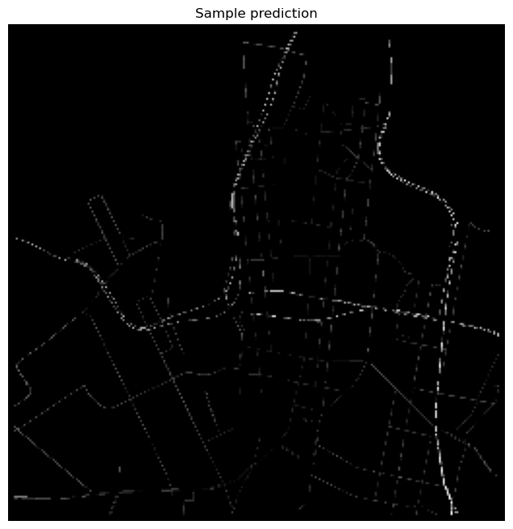
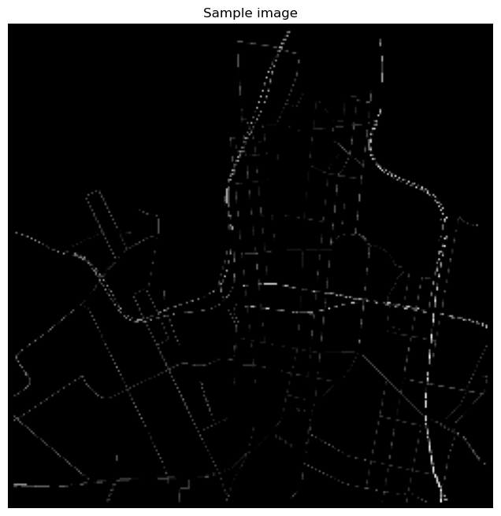

# Traffic Network Speed Prediction Using U-Net

**Author: Ider Byambadorj**

## Overview

This project involves predicting traffic network speed using a U-Net architecture. The dataset consists of multiple images showing traffic speed at various time intervals, and the goal is to predict future traffic speed maps. The model is trained using Binary Cross Entropy loss with masked pixels, meaning that only the relevant pixels (non-zero) contribute to the loss calculation.

The model was trained on AWS Sagemaker using ml.m7i.2xlarge instance. The dataset was first stored on S3 bucket then downloaded using boto3 function included in the notebook. 

## Project Structure

1. **Data Preparation**:
   - The dataset is structured with folders named `./dataset/train/<id>/` where each folder contains `input_0.png` to `input_4.png` (representing traffic speed at different time steps) and `label.png` (the target image for prediction).

2. **Model Architecture**:
   - The U-Net model is designed with encoder and decoder blocks to capture and reconstruct features from the input images.
   - **Encoder Blocks**: Reduce image dimensions and extract features.
   - **Decoder Blocks**: Upsample features and combine with skip connections from encoder blocks to reconstruct the output image.
   - **Activation Functions**: The model uses a relu activation function to predict pixel values directly. (making sure that values stay in the [0, 1] range.)

3. **Training**:
   - The model is trained with Binary Cross Entropy loss, where background pixels (black pixels) are masked out to ensure that the loss function only considers relevant pixels.
   - Batch size and other hyperparameters are adjusted based on memory constraints and training stability.

4. **Evaluation**:
   - After training, the model is evaluated on a validation dataset to ensure it meets the performance criteria.

## Key Decisions

### Why AWS SageMaker?
- **Scalability**: AWS SageMaker provides scalable resources that can handle large datasets and complex models without running into local resource constraints.
- **Ease of Use**: SageMaker integrates well with other AWS services like S3 for storage and EC2 for computation, making it easier to manage data and computational resources.
- **Cost-Effectiveness**: SageMaker offers a flexible pricing model where you pay for the resources you use, which can be more cost-effective than maintaining local hardware.

### Why 256x256 as Image Size?
- **Memory Constraints**: The original image size of 1200x1200 was too large to process efficiently with the available computational resources, leading to memory issues. Reducing the size to 256x256 helped mitigate these issues.
- **Training Speed**: Smaller images result in faster training times without significant loss in the model's ability to learn relevant features.

### Number of Filters and Layers
- **Filter Sizes**: The number of filters starts at 32 and doubles with each subsequent layer (32, 64, 128, 256, 512) in the encoder. This design allows the model to capture increasingly complex features as the image size decreases.
- **Number of Layers**: With a 256x256 image size, 5 layers (Encoder-Decoder blocks) were chosen to ensure the model captures sufficient depth and context without excessive computational overhead. This balances model complexity and computational efficiency.

## Steps to Run the Code

0. **Project Directory**:
   - `model.ipynb`: notebook containing the model
   - `traffic_speed_unet.h5`: trained U-Net Model with train loss of 0.0145 and validation loss of 0.0119
   - `*.png`: sample labels and predictions from the model
   - `dataset/`: dataset directory containing `train/` and `val/` folders.

1. **Setup Environment**:
   - Ensure you have TensorFlow installed:
     ```bash
     pip install tensorflow
     pip install opencv-python-headless
     ```

2. **Load Dataset**:
   - Place your dataset in the appropriate directory structure as outlined in the Project Structure section. (or run the `download_from_s3()` function to download the dataset from Amazon S3 bucket).

3. **Run Training**:
   - Run the code in the original order to start training the U-Net model. This script will handle data loading, preprocessing, model training, and saving the trained model. (run `Dataset`, `Building the U-Net Model` sections)

4. **Evaluate Model**:
   - After training, evaluate the model on the validation dataset by running the `Evaluate the model` section.

5. **Visualize Results**:
   - Use the provided functions to visualize predictions and compare them with ground truth images. Ensure that the pixel values are properly scaled before visualization. (1200x1200 -> 256x256)


### Figure: Example Predictions


### Figure: Example Label
